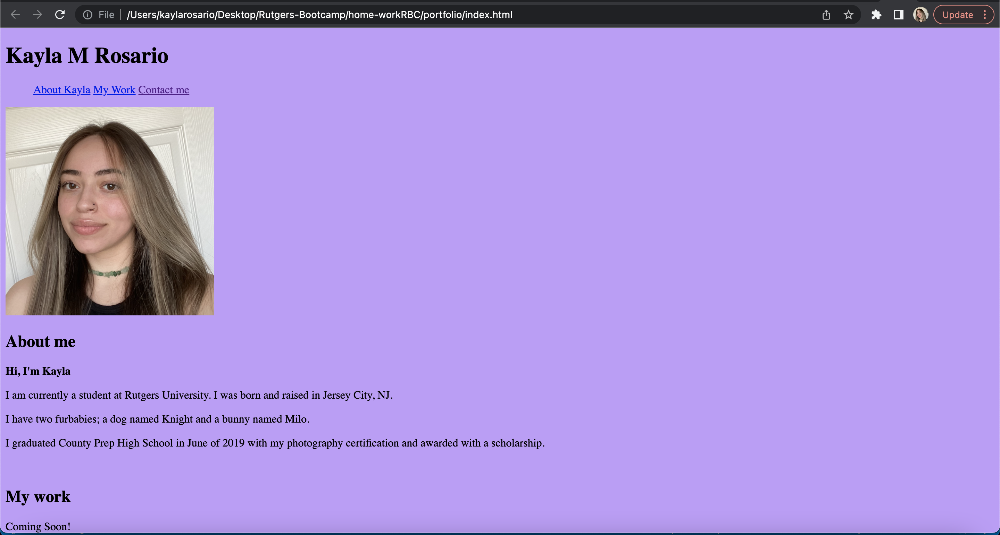

# Project: Portfolio

#
## Description
I created an HTML file to create my portfolio. The portfolio inludes a  < nav >  bar linking to specific sections of the page. I have a header with my name included. A body with sections titled "about me", "my work", and "contact me." A photo was attached so show user's my profile. The contact me section has links to where you can contact me. Then I included a small footer. To be continued and edited in the process.
#
## What does the application do?
#
## Acceptance Criteria
```
GIVEN I need to sample a potential employee's previous work
WHEN I load their portfolio
THEN I am presented with the developer's name, a recent photo or avatar, and links to sections about them, their work, and how to contact them
WHEN I click one of the links in the navigation
THEN the UI scrolls to the corresponding section
WHEN I click on the link to the section about their work
THEN the UI scrolls to a section with titled images of the developer's applications
WHEN I am presented with the developer's first application
THEN that application's image should be larger in size than the others
WHEN I click on the images of the applications
THEN I am taken to that deployed application
WHEN I resize the page or view the site on various screens and devices
THEN I am presented with a responsive layout that adapts to my viewport
```
#
## Resources
#
